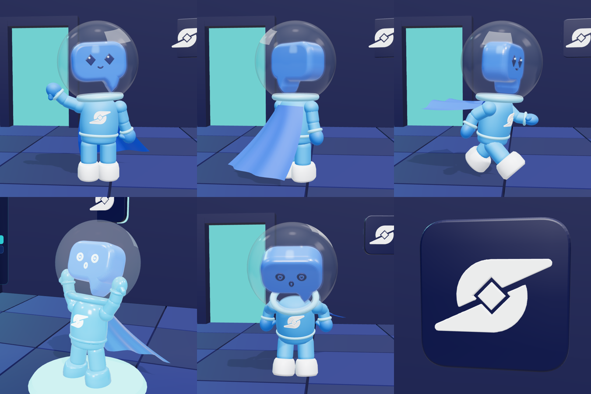

# puzzle-dlidla — Dli Echo Hero assets

3D assets for a puzzle-platformer where every failure becomes part of the level:
when the player dies they leave a solid **Echo** that can hold pressure plates,
block machinery and create a path forward.

The hero is the Dlicom mascot (glass bubble helmet, chat-bubble head, cape) built
procedurally in three.js. The **Dlicom logo** from the [@DlicomApp](https://x.com/DlicomApp)
brand mark replaces the "D" on the chest and is also exported as a standalone badge.



## Files

| File | Contents |
| --- | --- |
| `public/models/dli-hero.glb` | Playable hero, ~20k tris, clips: `Idle`, `Wave`, `Run`, `Jump`, `Death` |
| `public/models/dli-echo.glb` | Crystallized Echo frozen in the Death end pose, box collider in `extras` |
| `public/models/dlicom-badge.glb` | Dlicom logo badge for signage / checkpoints |

All models use meters, stand on the origin and face **+Z**. They have no textures;
every look comes from glTF PBR materials, so they load in Unity, Godot, Unreal or three.js.

## Rig and animation

The hero uses rigid node animation instead of skinning. Clips key these nodes:
`Hips`, `Torso`, `Head`, `ArmR/L`, `ForearmR/L`, `LegR/L`, `Cape`, `Face_Happy`, `Face_Shock`.

`Death` swaps to the shocked face (`Face_Shock` scale 0 → 1) and ends in the Echo pose,
arms up and legs braced, so it can act as a pillar or plate weight.

## Death → Echo in the game

```js
import { createDliEcho } from './src/assets/dliHero.js';

// When the Death clip finishes, snapshot the hero's current pose as a solid Echo.
const echo = createDliEcho({ source: heroScene });
echo.position.copy(heroScene.position);
level.add(echo); // echo.userData.collider / weight describe its physics body
```

`createDliEcho` clones the hero and remaps its materials by name to the Echo crystal set
(see `ECHO_SLOT` in `src/assets/palette.js`). It works with the loaded GLB as well as the
procedural model.

## Commands

```bash
pnpm install
pnpm build:assets   # regenerate public/models/*.glb from src/assets
pnpm dev            # viewer: animations, Death -> Echo demo, pressure plate + door
```

Viewer URL params for repeatable captures: `?focus=hero|echo|badge|scene&clip=Wave&t=0.2&yaw=0&capture=1`.

## Source layout

- `src/assets/dliHero.js`: hero and Echo builders
- `src/assets/animations.js`: poses and animation clips
- `src/assets/dlicomLogo.js` + `dlicomLogoData.js`: Dlicom logo traced to vector contours
- `src/assets/palette.js`: colors sampled from the mascot art and brand kit, hero and Echo materials
- `scripts/export-glb.mjs`: GLB exporter (Node)
- `src/viewer.js`: showcase scene that loads the exported GLBs
